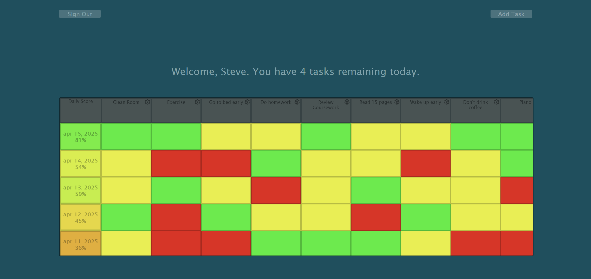

# Daily Habit Tracker
A simple daily tracker where you define all habits/tasks that you want to complete every day. Each task is represented as a red, yellow, or green block depending on completion status. Users are given a score depending on the percentage of completed tasks, and it is colored on a scale of red to green to give visual feedback to on how well they are doing. A new row of blocks is added every day, and days from the past are shown so that users can have visual markers for their progression.


## Installation

```
python -m venv venv
source venv/bin/activate  # On Windows use `venv\Scripts\activate`
pip install -r requirements.txt
flask run

```

## Usage
When you open the app, it will redirect you to sign up page if you are not signed in. Create an account or go to sign in page, enter information, and you will go to the home page.

### Production
The temporary production version of the app is at "https://mangodev.pythonanywhere.com/".
### Development
To run server locally use the command:
```
flask run
```
Terminal will indicate which URL the app is running on. By default, it should be http://127.0.0.1:5000 by default.

### Features
* Add a task
* Click on gear icon to open task menu, where you can change the task name or delete task
* Click on a task block to change from red(Unfinished) to yellow(Partially Finished) and again to change to green(Finished). Click one more time to reset status to unfinished
* Percentage will increase as status is changed
* Text at the top gives a simple overview on how to use app


## Tech Stack

- **Backend**: Python Flask
- **Frontend**: Vanilla Javascript, HTML, CSS
- **Database**: Custom Python NoSQL module
